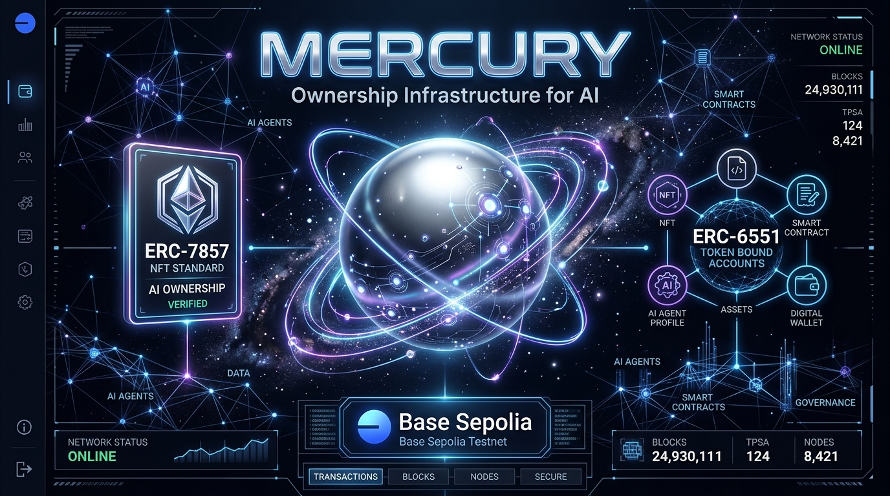
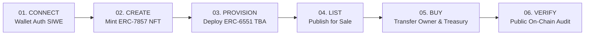
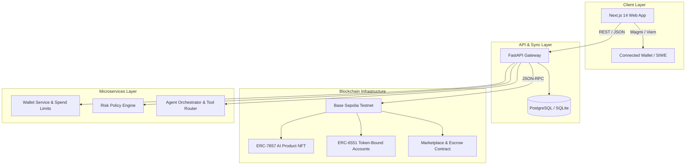
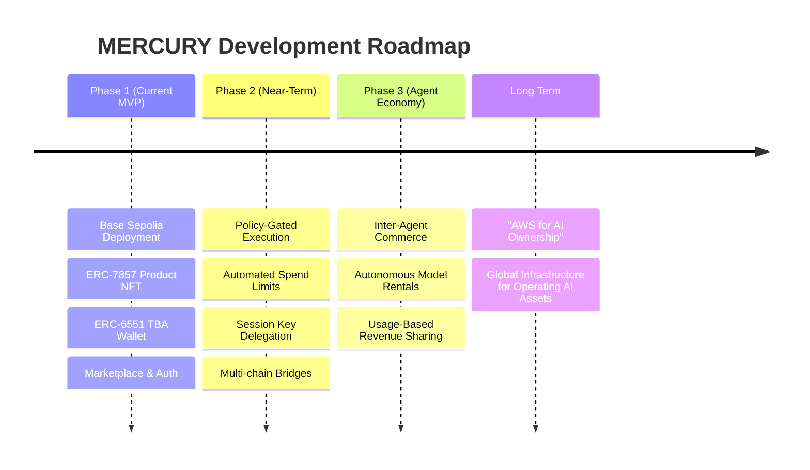

# 🪐 MERCURY — Ownership Infrastructure for AI

> **IEEE Hack Synapse 2026 · 36-Hour Offline Hackathon Submission**  
> *Organized by IEEE IAS & IEEE RAS MITS-DU, Gwalior in collaboration with HackIndia*  
> **Team Big-X**: Om Singh Jadon (Lead), Anuj Jain, Abhishek Kumar



[](https://github.com/OM2412/Big-X)
[](https://base.org)
[](https://eips.ethereum.org)
[](https://eips.ethereum.org)
[](https://nextjs.org)

---

## 📌 Executive Summary

> **"AI products should not just be subscribed to. They should be owned, traded, inherited, and operated."**

**MERCURY** is a decentralized **ownership and transfer layer for AI products**. Today, AI models and autonomous agents are locked inside Web2 SaaS subscriptions where creators cannot cleanly exit or sell their products, and buyers cannot trust that revenue streams, subscriber lists, or operating treasuries will transfer cleanly.

MERCURY turns **AI ownership into code**: uniting **programmable identity (ERC-7857 NFT)**, **autonomous agent treasuries (ERC-6551 Token-Bound Accounts)**, **on-chain revenue & royalty distribution**, and **auditable execution logs** into a seamless, Web2-friendly experience.

---

## 💥 The Problem: "The Internet Owns Apps. AI Still Rents Itself."

Today’s AI ecosystem suffers from severe structural distribution and monetization bottlenecks:

| Bottleneck | Real-World Consequence |
| :--- | :--- |
| **No Native Cap Table for AI** | AI is sold purely as SaaS/subscriptions. Creators cannot cleanly sell, exit, or transfer an AI product without legal chaos. |
| **Distribution Monopoly** | Out of **2.96 Million** public models on Hugging Face, **85.6%** have fewer than 200 lifetime downloads, while **1.5%** of repositories capture **99.2%** of all downloads. Specialized mid-size models lose on brand, not quality. |
| **Trustless Transfer Deficit** | Buyers cannot verify whether an AI agent's revenue, subscriber base, and operating permissions will move cleanly with the asset. |
| **No Creator Residuals** | Once an AI asset changes hands, original creators get 0% of future secondary resale value or tokenized agent performance. |

---

## 💡 The Solution: Mercury Ownership Layer

MERCURY captures the ownership layer between model creation and business value:

1. **Subscribe to Specialized Models**: Niche intelligence without buying the whole business.
2. **Own the AI Product Outright**: Full operating control, treasury balance, and subscriber revenues transfer instantly on-chain upon purchase.
3. **Automated Resale Royalties**: Original creators receive an automated smart contract royalty (e.g. 5%) on every secondary marketplace transfer.

---

## 🔄 The 6-Step Ownership Loop

Everything important happens twice: **on-chain for trustless proof**, and **off-chain for Web2 usability and speed**.



1. **CONNECT (`SIWE`)**: Cryptographic Sign-In With Ethereum for instant Web2/Web3 session generation.
2. **CREATE (`ERC-7857`)**: Mint AI product persona, model weights URI, and metadata as a verified product NFT.
3. **PROVISION (`ERC-6551`)**: Automatically deploy a Token-Bound Account (TBA) wallet tied directly to the NFT, allowing the agent to hold its own ETH/tokens.
4. **LIST (`Marketplace`)**: Set price and publish to the open agent marketplace with creator royalty parameters.
5. **BUY (`Escrow & Transfer`)**: Execute atomic transfer — ownership, TBA control, and subscriber privileges move to the buyer in a single transaction.
6. **VERIFY (`Audit Trail`)**: Full indexer sync updates local database truth while providing a public Base Sepolia transaction audit trail.

---

## 🏗 System Architecture & Technology Stack



### Core Technologies
- **Blockchain & Smart Contracts**: Solidity 0.8.24, Hardhat, Base Sepolia Testnet, ERC-7857 (AI Product NFT), ERC-6551 (Token-Bound Accounts), Viem, Wagmi.
- **Frontend App (`apps/web`)**: Next.js 14 (Pages Router), React 18, TypeScript, TailwindCSS, Custom 3D Metallic Graphics & Parallax animations.
- **Backend Gateway (`apps/api-gateway`)**: Python 3.13, FastAPI, Pydantic v2, SQLAlchemy 2.0, AsyncPG / AIOSQLite driver.
- **Microservices**: Wallet Service, Risk Policy Engine, Oracle Service, Tool Router.

---

## 🌟 Key MVP Features & Modules

- 🎨 **Responsive Landing Page**: Built with modern 3D coin background animation, dynamic motion controls, and interactive ecosystem walkthroughs.
- 📊 **Agent Dashboard**: Real-time tracking of owned portfolio value, token-bound asset balances, estimated creator royalties, and active agent instances.
- 🏬 **Agent Marketplace**: Discover, search, inspect, buy, and list AI agents with automated seller settlements and creator royalties.
- 🛠 **Agent Studio**: No-code creation interface to define persona, model endpoints, metadata, and mint on-chain agent identities.
- 💬 **Agent Chat Interface**: Live interaction console allowing users to execute tasks with deployed agent personas.
- 📜 **On-Chain Activity Inspector**: Complete public audit trail of transfers, deployments, and revenue events on Base Sepolia.

---

## 📈 Market Impact & Valuation Potential

- **$900B**: Total AI Market Estimated for 2026.
- **$183B**: AI Agents Market projected by 2033 (**49.6% CAGR**).
- **USP**: MERCURY unlocks an entirely new asset class by transforming static AI models into ownable, liquid, tradeable business entities.

---

## 🛣 Future Scope & Roadmap



---

## 🚀 Quickstart & Local Setup Guide

### 1. Prerequisites
- **Node.js** >= 18.x & **pnpm** / **npm**
- **Python** >= 3.11

### 2. Installation
```bash
# Clone the repository
git clone https://github.com/OM2412/Big-X.git
cd Big-X

# Install frontend dependencies
cd apps/web
npm install

# Install Python backend dependencies
cd ../..
pip install -r apps/api-gateway/requirements.txt
```

### 3. Database & Demo Data Setup
```bash
# Seed local database with demo user, agents, and transaction logs
$env:DATABASE_URL="sqlite+aiosqlite:///./agentic.db"
python seed_demo_data.py --user-wallet 0xaea2df838df0b8b6b9e8fd4e41e12e91114e15e0
```

### 4. Running the Application
```bash
# Terminal 1: Run Backend API Gateway (Port 8000)
$env:DATABASE_URL="sqlite+aiosqlite:///./agentic.db"
$env:PYTHONPATH="."
python -m uvicorn apps.api-gateway.src.main:app --host 127.0.0.1 --port 8000

# Terminal 2: Run Frontend Next.js Web App (Port 3000)
cd apps/web
npm run dev
```

### 5. Verification Command
```bash
# Verify all live API endpoints
python verify_backend_api.py
```

---

## 🏆 Team Big-X

| Member | Role | Focus Areas |
| :--- | :--- | :--- |
| **Om Singh Jadon** | Team Lead & Full-Stack Architect | Smart Contracts, API Gateway, Next.js Frontend |
| **Anuj Jain** | Backend & Systems Engineer | Microservices, Database Layer, Smart Contract Integration |
| **Abhishek Kumar** | Web3 & AI Engineer | SIWE Authentication, Agent Studio & Marketplace Logic |

---

<div align="center">
  <sub>Built with ❤️ by <strong>Team Big-X</strong> for <strong>IEEE Hack Synapse 2026</strong> · MITS-DU, Gwalior</sub>
</div>
